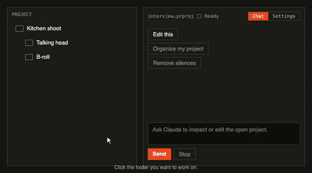

# Claude for Adobe

Claude Code, inside Premiere Pro. Talk to it about your timeline, let it make the cuts, remove silences, ask what was said. Free, open source, runs on your Mac with your own Claude account.

**Install:** [download ClaudeForAdobe.zip](https://github.com/dandjlab-cell/claude-for-adobe/releases/latest/download/ClaudeForAdobe.zip), double-click it to unzip, right-click `Install.command` > Open, restart Premiere, then **Window > Extensions > Claude for Premiere**. You need the Claude desktop app signed in (open Claude Code in it once) or the Claude Code CLI. Updates come through a button in the panel.



Click the folder you want to work on, then ask Claude to edit it. Tip: keep b-roll in a separate folder from the talking head; it helps Claude a lot. Edits go to a duplicate sequence, so your original is never touched. Like any Claude Code session, what Claude reads goes to Anthropic under your account.

Updated regularly; the panel tells you when a new version is ready and installs it in one click. Coming next: After Effects, and Codex as an alternative to Claude.


A personal CEP panel that runs **Claude Code inside Adobe Premiere Pro 2026**. Claude gets four
tools; the panel executes them, shows each call and result, and checkpoints the `.prproj` before
anything mutating runs.

| Tool | What Claude gets | How |
|---|---|---|
| `run_extendscript` | the value of an ES3 script's final expression | `evalScript` through the guard in `src/core.cjs` |
| `preview_frames` | up to 6 rendered frames of the active sequence, as images | QE `exportFramePNG`, downscaled with `sips` |
| `analyze_audio` | per-clip peak windows, a waveform sparkline, silence ranges for a timeline range | reads Premiere's own `.pek` peak-file cache (the timeline waveform) via `src/pek.cjs`; `ffmpeg` on the source file only if no peak file exists |
| `media_info` | resolution, fps, duration, channels of a clip's source file | `ffprobe`; the path must belong to a project item |
| `remove_silences` | plan, then remove silent ranges (dB method, default) | silence from Premiere's peak-file waveform; Premiere's own Extract per range via QE, linked video+audio together, one History step per range |
| `remove_pauses` | plan, then remove pauses (transcript method, Premiere's "Delete all pauses") | word gaps >= 0.75 s from the transcript in the saved `.prproj` (decoded by `src/transcript-blob.cjs`), optional waveform veto; same Extract apply |
| `transcribe_whisper` | Whisper large-v3-turbo transcript of every clip's source audio, cached; writes `.transcript.json` files for Text panel > Import transcript | bundled whisper.cpp large-v3-turbo with Silero VAD in front, word timestamps; converter to Premiere's transcript JSON shape |
| `sequence_overview` | the live active sequence: every clip per track with times, in point, media path | one ExtendScript walk of the DOM |

## Deterministic tools, small models

Every edit the panel offers is a fixed recipe in `host/premiere.jsx` and `panel.js`; the model only
chooses the tool and its parameters and relays the plan. The system prompt spells out the
silence recipe step by step (plan, show, confirm, apply, report), so Sonnet or Haiku can run it.
`remove_silences` is the dB method (instant, from Premiere's waveform cache; `threshold_db` overrides
the auto noise-floor threshold). `remove_pauses` is Premiere's transcript method and needs a
transcript in the saved project; it decodes the transcript with
`src/transcript-blob.cjs` (a port of the cracked Python decoder; no Python needed).

## Whisper in Premiere

Premiere's own speech-to-text engine cannot be swapped. What works instead: `transcribe_whisper`
runs Whisper large-v3-turbo locally on each clip's source audio (about 10x realtime on Apple
Silicon), caches the words, and writes a `.transcript.json` per clip into `_claude-for-adobe_transcripts/`
next to the project. In the Text panel, Import transcript on that file makes it Premiere's native
transcript, so text-based editing, captions, and Delete all pauses work on it. The panel's own
`remove_pauses` can use the Whisper words directly without importing (`source=whisper`).

Decoding settings: temperature
0, no conditioning on previous text, plus Whisper's no-speech, compression-ratio, log-prob and
hallucination-silence guards. Voice activity comes from Premiere's own waveform: only the
speech regions from the peak file are passed to Whisper (`--clip-timestamps`), so silence cannot
produce hallucinated text. No forced alignment;
word timing here is Whisper's own cross-attention timing, roughly tens of milliseconds.

Premiere's built-in engine is Adobe's own MCSpeechToText (MediaCore Speech to Text) with its
SpeechESL language models (3.2 GB under `/Library/Application Support/Adobe/Premiere Pro/26.0/`).
It cannot be replaced or configured from a panel.

## Claude sees the timeline live

The panel binds Premiere's own host events with `app.bind` (sequence structure changed, track item
added/removed, sequence activated, project changed), the same events Adobe's PProPanel sample
uses. Each callback relays through a `CSXSEvent`; the panel debounces, snapshots the active
sequence keyed by clip node id, and diffs it against the last snapshot. Edits you make between
Claude's turns are prepended to your next message as a bracketed change list ("moved V1 "one"
0.00s-5.00s -> 1.00s-6.00s"), and the status line shows "timeline changed (n)". Edits made during
Claude's own turn are not reported back to it. This is the CEP counterpart of the UXP
`ProjectEvent.DIRTY` doorbell from the karaoke work.

The media tools run in the panel's Node context, which is why scripts can stay fenced off from the
filesystem and the encoder. `analyze_audio` reads the per-clip waveform (like the timeline does), so
timeline volume and effects are not reflected; for the mixed sequence audio you would need
`sequence.exportAsMediaDirect` with a WAV preset, which was deliberately not built.
Frames have no cached-pixel source in Premiere; `preview_frames` asks Premiere's renderer for the
frame (the Export Frame path), reads it back as a small JPEG, and deletes the temp file.

`ffmpeg`/`ffprobe` at `/opt/homebrew/bin` or `/usr/local/bin` are needed only for `media_info` and
the no-peak-file fallback.

The panel hosts a tiny MCP server over local HTTP in its own
Node context, spawns the installed `claude` CLI with `--output-format stream-json`, and points it at
that server with `--mcp-config`. No API key handling: it uses your existing Claude Code login.

## Install

**From the zip (users):** unzip, double-click `Install.command` (first time: right-click > Open), restart Premiere.
It copies the folder into `~/Library/Application Support/Adobe/CEP/extensions`, clears quarantine on the
bundled VAD binary, and enables unsigned panels. Build the zip with `sh scripts/package.sh` (-> `dist/`).

**From the repo (dev):**

```sh
sh scripts/install.sh      # symlink into ~/Library/Application Support/Adobe/CEP/extensions, enable PlayerDebugMode
```

Restart Premiere, then **Window > Extensions > Claude for Premiere**. Chrome DevTools for the panel:
`http://localhost:9295`.

Requires Claude Code, logged in: the Claude desktop app is enough (the panel finds its bundled CLI under `~/Library/Application Support/Claude/claude-code/`), or the CLI at `~/.local/bin/claude`, `/opt/homebrew/bin/claude`, or `$CLAUDE_PATH`.
Apple Silicon only for the voice silence cutter and Whisper: `bin/` ships whisper.cpp (VAD + transcription) with its ggml libraries; the Whisper large-v3-turbo model (~570 MB) downloads once on first use into `~/Library/Caches/claude-for-adobe/models`; audio is extracted with macOS `afconvert` (ffmpeg only as a fallback for formats CoreAudio can't open).
Default model is Opus 5; the dropdown lists Fable 5.1, Opus 5, Sonnet 5, Haiku 4.5. If the chosen model isn't available on the account, the panel falls back to Sonnet 5 and says so.

## Use

Type a request, press Enter. Claude inspects the project by running ExtendScript, then edits it if
asked. Every tool call appears as a collapsible card with the code and the result.

- **Model** dropdown switches models, keeping the conversation (`--resume`).
- **Stop** kills the current turn and resumes the same conversation.
- **New** starts a fresh conversation.
- **Checkpoint files before mutations** (default off): when on, a mutating script is blocked unless
  the project is a saved local `.prproj` that can be copied first.

## Edits go to a duplicate sequence

Before the first edit on a sequence, the panel duplicates it inside the project (`sequence.clone()`),
names the copy `<name> [Claude]`, and makes it active. Every edit lands on the copy; the original is
never touched. The **Working copies** list has **Open original** and **Discard copy** buttons, so
reverting is opening the original and deleting the copy. Nothing is written to disk. Turn this off
with the **Edit a duplicate sequence** checkbox if you want edits in place.

## Undo inside Premiere; file checkpoints are opt-in

A mutating script runs directly against the open project (the working copy) and nothing is
written to disk. Scripted edits land in Premiere's own History, so Cmd+Z reverses them, one undo step per API
call; Claude is instructed to batch each logical edit into as few calls as possible and to say how
many Cmd+Z presses reverse it. There is no scripted undo *grouping* in Premiere's ExtendScript DOM.

Tick **Checkpoint files before mutations** to also get the file-level safety net: before any
mutating script the panel **saves the project** (the file on disk is otherwise only the last save)
and copies it to `_claude-for-adobe_checkpoints/` next to it, with a manifest recording size and sha1.

**Revert** sequence: save, keep a recovery checkpoint of the current state, open a
temporary holding copy so the original path is not open, copy the checkpoint over the original,
reopen it, delete the holding copy. A checkpoint whose hash no longer matches is shown as corrupt
and cannot be reverted.

## Session behaviour

- Each Claude process has a generation; events from a stopped process are ignored, so Stop, New,
  and model switches never leave the panel disabled.
- Stop ends the process gracefully (SIGTERM, then SIGKILL) and resumes the same conversation.
- An unexpected exit mid-turn restarts once with the conversation kept.
- Text streams in as it is generated; the status line names the running script.
- A script that does not return in 3 minutes (a Premiere dialog is open) fails the tool call so the
  turn can finish.
- The open project is polled every second; a project switch refreshes the checkpoint list.

## Checks

```sh
node --test test/*.test.cjs       # guards, checkpoint, MCP server, stream-json reducer
node scripts/probe-claude.cjs     # live: real claude CLI, fake Premiere tool, asserts the round trip
```

## What the installer changes and what Claude can do

`Install.command` copies the panel into `~/Library/Application Support/Adobe/CEP/extensions/com.claude-for-adobe.premiere`, clears the macOS quarantine flag on that folder only (so the bundled voice binary can run), and sets Adobe's `PlayerDebugMode` preference, which lets Premiere load unsigned panels. That preference is global to CEP; a signed ZXP build would remove the need for it.

Claude reaches Premiere only through the panel's tools. Its own file, shell, and web tools are disabled, and the panel's MCP endpoint is bound to 127.0.0.1 with a per-session bearer token. Scripts Claude writes go through a guard: saving, exporting, quitting, opening projects, file and shell objects, and dynamic evaluation are refused outright; anything that is not a provable plain read waits for your click in the panel before it runs. Edits go to a duplicate sequence, and actions Cmd+Z cannot undo get a file checkpoint first.

## Developing

Two panels can run side by side:

- **Shipped**: what users get. Install from the zip. Updates itself from GitHub Releases.
- **Dev**: `sh scripts/install.sh` creates "Claude for Premiere (dev)" as symlinks into this repo, with its own
  extension id and DevTools on port 9296. Edit, then close and reopen the dev panel (restart Premiere for
  `host/premiere.jsx` changes). The dev panel never self-updates.

Flow: work on a branch, `node --test test/*.test.cjs` (includes a host-script integrity test), try it in the dev
panel on a sandbox project, merge to `main`. To ship: bump the version in `CSXS/manifest.xml` and `package.json`
(they must match), `sh scripts/package.sh`, then
`gh release create vX.Y.Z dist/ClaudeForAdobe-X.Y.Z.zip dist/ClaudeForAdobe.zip`. Every installed copy sees the
update on its next open. Before anything that touches the installer, updater, or host script, run an independent
review (`docs/codex-review-log.md` shows the format).

## Remove

```sh
rm -r ~/Library/Application\ Support/Adobe/CEP/extensions/com.claude-for-adobe.premiere
```

## Layout

```text
src/core.cjs            ExtendScript wrapper + layered guard (M1)
src/checkpoint.cjs      .prproj checkpoint create/list/revert
src/mcp-http.cjs        in-panel MCP server (JSON-RPC over HTTP)
src/claude-session.cjs  spawns claude CLI, stream-json in/out, system prompt
src/media.cjs           sips resize, level/silence reports, ffmpeg fallback, ffprobe
src/pek.cjs             Premiere .pek peak-file decoder (68-byte header, int16 max/min per 256 samples)
src/timeline.cjs        sequence snapshot parser, diff, formatter
src/silence.cjs         silence planning across tracks (coverage minus loud, padding, min length)
src/transcript.cjs      .prproj transcript blobs -> clip ownership -> words (src/transcript-blob.cjs) -> lines/pauses
src/whisper.cjs         bundled whisper.cpp transcription (model on first use, cached), -> Premiere transcript JSON
src/classify.cjs        speech coverage -> talking head / b-roll / mixed guess
host/premiere.jsx       ALL ExtendScript, ES3, loaded once at boot (PCX.*); panel.js builds no scripts
panel.js / index.html   chat UI, tool execution via evalScript
CSXS/manifest.xml       CEP manifest (PPRO 25+, --enable-nodejs --mixed-context)
scripts/install.sh      symlink + debug mode
scripts/probe-claude.cjs
```
